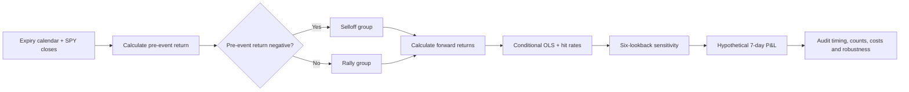
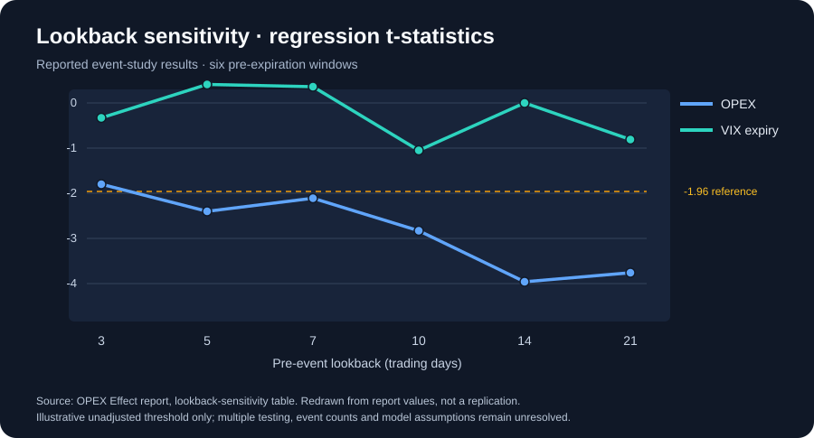

# The OPEX effect: does a pre-expiration selloff precede a rebound?

**Exploratory event study · SPY · historical research · results not independently replicated**

[← Research library](../../README.md) · [Figure: lookback sensitivity](figures/lookback-sensitivity.svg) · [PDF publication review](PUBLICATION_REVIEW.md)

> **Reading note:** This case study presents the supplied *OPEX Effect — Backtest Report*; it is not a newly run backtest. All numerical results below are **reported by that document**. The original workbook, event log and price observations have not been supplied for independent reproduction. Both stated monthly-event counts need reconciliation before relying on the statistical inference.

## Research question

Does the magnitude of SPY's return **before** an equity-options expiration event relate to SPY's return **after** the event? The report compares that pattern with a separate sample of VIX-expiration dates. A possible explanation proposed in the report is that expiry-related dealer hedging can generate transient order flow, but dealer inventory and hedge flows were **not measured**: the mechanism remains a hypothesis.

## Study at a glance

| Design element | Implementation described in the report |
|---|---|
| Asset | SPY |
| Equity-OPEX study window | January 2020–December 2025; **80 events claimed within 72 months, not reconciled** |
| VIX-expiration comparison window | May 2004–December 2025; **276 events claimed within 260 months, not reconciled** |
| Pre-event lookbacks | 3, 5, 7, 10, 14 and 21 trading days; 7 days is the default |
| Forward horizons | 1, 2, 3, 5, 7, 10, 14 and 21 trading days |
| Conditional groups | Pre-event return < 0: selloff; otherwise: rally |
| Statistical method | Simple OLS of forward return on pre-event return, overall and by subgroup |
| Hypothetical trade | Buy SPY at the event-day close; sell at the close seven trading days later |
| Costs and validation | Transaction costs excluded; no untouched out-of-sample period documented |

### Research workflow

For event date *t*, the explanatory variable is the return over the chosen window before *t* and the outcome is the return over a specified window after *t*. The regression takes the form `forward_return = alpha + beta × pre_event_return + error`. A negative estimated beta is consistent with mean reversion **within the sampled observations**; it does not, on its own, establish causality or a tradable edge.

## What the report found

### 1. The conditional 7-day comparison

These are the report's unreplicated regression outputs; the group sizes sum to its unreconciled event totals.

| Event group | Reported events | Beta | R² | t-statistic |
|---|---:|---:|---:|---:|
| Equity OPEX, pre-event selloff | 34 | -0.614 | 26.3% | -3.38 |
| Equity OPEX, pre-event rally | 46 | +0.072 | 0.5% | +0.46 |
| VIX expiry, pre-event selloff | 103 | -0.116 | 0.8% | -0.88 |
| VIX expiry, pre-event rally | 173 | +0.063 | 0.3% | +0.71 |

The report interprets the negative OPEX/selloff slope as a potential reversal pattern. Its other three subgroup regressions do not exhibit a comparable estimated slope. The SPY/VIX comparison is **not a matched control experiment**: the windows differ materially, and the event mechanics differ too.

### 2. How sensitive is the pattern to the lookback?

*Figure 1. Original visualization redrawn from the report's six-lookback table, rather than copied from a third-party image. The chart illustrates reported **unconditional** regression t-statistics, not the conditional -3.38 estimate above. It is not an independently reproduced analysis. The -1.96 line is an illustrative conventional threshold and does not adjust for testing six lookbacks, eight forward horizons or subgroup choices.*

| Pre-event lookback | Equity OPEX beta | Equity OPEX t | VIX-expiry t |
|---|---:|---:|---:|
| 3 trading days | -0.289 | -1.80 | -0.33 |
| 5 trading days | -0.264 | -2.40 | +0.41 |
| 7 trading days | -0.193 | -2.11 | +0.36 |
| 10 trading days | -0.213 | -2.83 | -1.05 |
| 14 trading days | -0.229 | -3.96 | 0.00 |
| 21 trading days | -0.203 | -3.76 | -0.81 |

The report finds that the negative equity-OPEX coefficient appears across several lookbacks. Selecting the strongest result after testing alternatives, however, inflates nominal statistical significance unless the search is addressed with corrected inference or an untouched test set.

### 3. How did average post-event returns vary by horizon?

| Forward horizon | OPEX after selloff: reported mean SPY return | VIX expiry after selloff: reported mean SPY return |
|---|---:|---:|
| 1 day | +0.09% | -0.39% |
| 3 days | +0.47% | -0.60% |
| 7 days | +0.69% | -0.14% |
| 10 days | +1.03% | +0.42% |
| 14 days | +0.81% | +0.43% |
| 21 days | +1.14% | +0.21% |

These are cross-event conditional means reported at different, sometimes overlapping, horizons. They are **not** an independently verified equity curve or forecast. The source also reports a 61.8% seven-day hit rate for its OPEX selloff group, based on its claimed 34 events.

## Hypothetical backtest: what was actually tested?

The report describes a naïve long-SPY position entered at the close of each qualifying expiry event and exited after seven trading days. It reports +0.69% average return/trade and 0.42 Sharpe for the selloff-only subset, and +0.72% average return/trade and 0.88 Sharpe for all claimed OPEX events. **These are source claims, not performance verified against a trade log.** The strategy omits transaction costs and has no independently reconciled calendar, cash accounting, exposure timing, benchmark or out-of-sample test here. The source explicitly identifies March 2020 as a potentially influential extreme observation.

A positive long-SPY return near an event may reflect the market's unconditional equity exposure rather than an expiration-specific effect. A complete study should compare matched non-event windows and exposure-adjusted benchmarks, not infer incremental alpha from positive returns alone.

## Data quality and validation: checks before calling the effect tradable

1. **Resolve both denominators.** January 2020–December 2025 spans 72 months but the report calls its OPEX sample 80 *monthly* dates; May 2004–December 2025 spans 260 months but it calls its VIX sample 276 *monthly* dates. Obtain the exact `OPEX_Dates` and `VIX_Expiry_Dates` lists, establish event types, and reconcile subgroup counts.
2. **Verify information timing.** Establish whether event-day close and the pre-event signal can be observed before an order would be submitted; check holidays and VIX settlement conventions separately.
3. **Use comparable windows.** The OPEX sample is 2020–2025 while the VIX sample is 2004–2025. Rerun both over a common historical interval before treating differences as supporting a mechanism.
4. **Control the testing search.** Six lookbacks × eight horizons × subgroup splits are not one prespecified hypothesis. Assess multiple testing, overlapping observations and sensitivity to March 2020.
5. **Rebuild performance from event-level trades.** Check simple vs compounded returns, maximum drawdown, time out of the market, dividends, costs, financing and a buy-and-hold or calendar-matched SPY benchmark.
6. **Validate prospectively.** Freeze the rules, test an untouched time period and, if feasible, an additional ETF universe before making claims about repeatability.
7. **Test the causal explanation.** Obtain appropriate dealer-gamma or hedging-flow proxies if the aim is to claim an expiration-flow mechanism rather than an event-date correlation.

## Full paper and publication status

An editorially prepared **full PDF edition** preserves the supplied research text, charts, tables, results and captions and adds a publication notice. It is **not yet uploaded to this GitHub repository**; binary upload and confirmation of the source graphics/data's distribution rights remain outstanding. [Read the PDF's visual review and issue log](PUBLICATION_REVIEW.md). Once its file has been uploaded to this directory and verified, a working PDF download link can be added here. No underlying workbook or event-level data has been supplied.

**Research-only disclosure:** This is exploratory historical analysis, not verified live performance or a recommendation to trade around options expiration.
